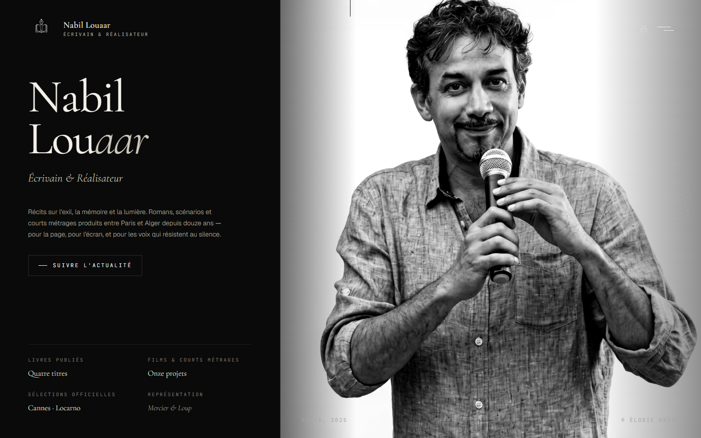

# Nabil Louaar — Portfolio

## Description

Site portfolio de **Nabil Louaar**, écrivain et réalisateur franco-algérien. Il sert de vitrine professionnelle unique regroupant :

- sa **bibliographie** (modèle `Writing` : titre, année, éditeur, description, couverture, badge),
- sa **filmographie** (modèle `Video` : titre, durée, type, année, festival),
- une section de **présentation/biographie**,
- un formulaire d'**inscription newsletter** (modèle `Subscriber`),
- un **espace d'administration** protégé par mot de passe (`/admin`) permettant de gérer le contenu (vidéos, écrits, réglages) sans redéploiement.

Le site est destiné à la promotion de son travail auprès du public, de la presse et des professionnels du milieu (agents, festivals, éditeurs).

## Stack / Environnement / BDD

| Couche | Détail |
|---|---|
| Framework | Next.js **16.2.9** — App Router + Turbopack |
| Langage | TypeScript **5** |
| Styling | Tailwind CSS **v4** + composants shadcn/ui + MagicUI |
| ORM | Prisma **7.8.0** (client généré dans `src/generated/prisma`, adapter `@prisma/adapter-pg`) |
| Base de données | PostgreSQL (Neon en prod, PostgreSQL natif Windows en local) |
| Auth | Authentification admin maison — JWT (`jose`) + hash de mot de passe (`bcryptjs`), pas de NextAuth |
| Rate limiting | Upstash Redis + `@upstash/ratelimit` (fallback in-memory si absent) |
| Validation | Zod **4** |
| Tests | Vitest **4** |
| Gestionnaire de paquets | npm |

### Variables d'environnement (`.env.example`)

```env
DATABASE_URL              # Connexion PostgreSQL (pooler) — Neon en prod, natif en dev
DIRECT_URL                # Connexion PostgreSQL directe (migrations Prisma)
ADMIN_JWT_SECRET          # Secret JWT admin (32+ caractères aléatoires)
ADMIN_PASSWORD_HASH       # Hash bcrypt du mot de passe admin (jamais en clair)
UPSTASH_REDIS_REST_URL    # Upstash Redis — rate limiting distribué (optionnel)
UPSTASH_REDIS_REST_TOKEN  # Token Upstash Redis (optionnel)
```

## Architecture des dossiers/fichiers

```
nabil-louaar-portfolio/
├── prisma/
│   ├── schema.prisma        # Modèles : Video, Writing, AdminConfig, Subscriber
│   └── migrations/          # Historique des migrations Prisma
├── prisma.config.ts         # Configuration Prisma 7 (URLs de connexion)
├── public/
│   ├── images/               # Portraits, logos (WebP)
│   ├── sitemap.xml, robots.txt, llms.txt
├── docs/
│   └── screenshot-home.png  # Capture d'écran de la page d'accueil (prod)
├── scripts/
│   └── gen-favicon.cjs       # Génération du favicon depuis le monogramme
├── src/
│   ├── app/                  # Routes Next.js (App Router)
│   │   ├── admin/            # Dashboard admin : login, vidéos, écrits, réglages
│   │   ├── api/
│   │   │   ├── admin/        # Routes API protégées : login, logout, CRUD vidéos/écrits
│   │   │   └── newsletter/   # Inscription newsletter
│   │   ├── cgu/, mentions-legales/, politique-confidentialite/  # Pages légales RGPD
│   │   ├── layout.tsx        # Layout racine — fonts, SEO, JSON-LD
│   │   ├── page.tsx          # Page d'accueil (assemble les sections, force-dynamic)
│   │   ├── error.tsx, not-found.tsx
│   │   ├── robots.ts         # Génération robots.txt
│   │   └── sitemap.ts        # Génération sitemap.xml
│   ├── components/
│   │   ├── layout/            # Header, Footer, NavigationOverlay, BackToTop
│   │   ├── sections/          # HeroSection, PresentationSection, WritingSection,
│   │   │                      #   VideoSection, NewsletterSection, FaqSection
│   │   ├── nabil/              # BookShelf, VideoCard, SectionHeader (UI spécifiques au site)
│   │   ├── magicui/            # Composants MagicUI
│   │   ├── rgpd/                # CookieConsent
│   │   ├── ui/                   # button, input (shadcn/ui)
│   │   └── RouteScrollReset.tsx
│   ├── data/
│   │   └── books.ts           # Données statiques complémentaires
│   ├── lib/
│   │   ├── db.ts               # Singleton PrismaClient (adapter PostgreSQL)
│   │   ├── auth.ts / auth-edge.ts  # JWT (jose) + hash password (bcryptjs)
│   │   ├── rate-limit.ts       # Rate limiting Upstash
│   │   └── utils.ts, fonts.ts
│   ├── generated/prisma/      # Client Prisma généré
│   └── middleware.ts           # Protection des routes /admin/*
├── components.json             # Config shadcn/ui
├── vercel.json
└── vitest.config.ts
```

## Auteur

ZarogDev — 2026

## Démo en ligne

[https://nabil-louaar-portfolio.vercel.app](https://nabil-louaar-portfolio.vercel.app)

## Aperçu


